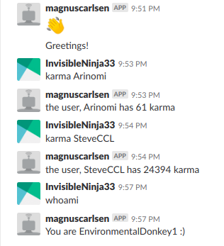

# Assignment 3 (Group) in IMT2681 Cloud Technologies

# reddit_api

This project creates an API which can be used by developers. This API is used specific for reddit and comes with an user and "admin" functionality. To make this more "user friendly" - it is possible to communicate through a slack bot, which handles simple requests (limited functionality) using the created API. 

Technologies used:
- Docker
- Go
- MongoDB
- OpenStack
- Slack (bot)

## Scope
Our scope is to make a reddit API with different end points (the endpoints below). We also wanted some database functionality for admin users so we made use of mongodb in some end points. We also figured out that we want to make a small slack bot to make use of our already implemented reddit API(we haven't made alot because time did't allow this). We also decided deploy all this in Openstack with docker. 

Further development:

Difficulties:
- We had issues using Dialogflow - the connection with the API (request & response) - and decided to use the bot application provided from Slack.
- We had some issues using the module for the slack bot (on some of the computers) and had to resort to pair-programming

## Descriptions

## API
### GET: localhost:8080/reddit/
Redirects to localhost:8080/reddit/api/

### GET: localhost:8080/reddit/api/
Uptime of the service
```json
{
  "uptime": "<uptime>",
  "info": "Reddit api",
  "version": "v1" 
}
```
  
### GET: localhost:8080/reddit/api/me/
* What: Gets the user info thats connected to reddit.

* Response:

```json
{
    "id": "27lh22f3",
    "name": "EnvironmentalDonkey1",
    "created": 1541945447,
    "Karma": {
        "comment_karma": 0,
        "link_karma": 0
    },
    "url": ""
}
```

### GET: localhost:8080/reddit/api/me/karma/
* What: Gets the karma of the user.

* Response:

```json
{
  "comment_karma": "<int>",
  "link_karma": "<int>",
}
```

### GET: localhost:8080/reddit/api/me/friends/
* What: Gets all the friends of the user.

* Response:

```json
{
	"date": "<float32>",
	"name": "<string>",
	"id": "<string>",
}
```

### GET: localhost:8080/reddit/api/me/prefs/
* What: Get the preferences of the user.

* Response:

```json
{
 
	"research": "<bool>",
	"show_trending": "<bool>",
	"private_feeds": "<bool>",
	"ignore_suggested_sort": "<bool>",
	"over_18": "<bool>",
	"email_messages": "<bool>",
	"force_https": "<bool>",
	"lang": "<string>",
	"hide_from_robots": "<bool>",
	"public_votes": "<bool>",
	"hide_ads": "<bool>",
	"beta": "<bool>",
}
```


### POST: localhost:8080/reddit/api/submission/
* What: POST takes the following body:
1. keyword, which posts to search for.
2. sortType (new, hot, etc) 
3. cap defines how many posts you want returned, se the example request body below.

* Body:
```json
{
	"keyword": "soccer", "sortType": "new", "cap": 3
}
```
* Response:
```json
[
    {
        "title": "For everyone who don't get xG, It is explained really well here",
        "author": "vivlam",
        "subreddit": "soccer",
        "name": "",
        "numComments": 0,
        "score": 0
    },
    {
        "title": "Old Firm Facts: Shower BT Sport with love ... for the sake of the kids",
        "author": "AonghusMacKilkenny",
        "subreddit": "soccer",
        "name": "",
        "numComments": 0,
        "score": 0
    }
]
```

### GET: localhost:8080/reddit/api/{username}/karma/
* What: Get the karma of an arbitrary user
* request 
```
{username} - <string>  the reddit username
```
* Response:

```json
 {
        "title": "Replicating SteamAvatar in PlayerState keeps failing (UniqueNetID bad error)",
        "author": "-gon",
        "subreddit": "unrealengine",
        "name": "t3_9yk3ca",
        "numComments": 0,
        "score": 1
    },
    {
        "title": "marxists rise up",
        "author": "pls_help_me_2",
        "subreddit": "CommunismMemes",
        "name": "t3_9yk3c7",
        "numComments": 0,
        "score": 1
    }
  }
```

### GET: localhost:8080/reddit/api/{cap}/frontpage/{sortby}/
* What: Gets posts from reddits frontpage, you can spesify which posts by sortype (e.g hot, new etc)
* request: localhost:8080/reddit/api/3/frontpage/hot/

```
 {cap} - <int>  that specifies how many posts to be received
 {sortby} - <"string">: new, best, top, rising, hot, controversial
```

* Response: List of submission objects

```json
[
    {
        "title": "Where is the lie?",
        "author": "GriffonsChainsaw",
        "subreddit": "BlackPeopleTwitter",
        "name": "t3_9yglcb",
        "numComments": 65,
        "score": 33469
    },
    {
        "title": "[Serious] Cancer survivors of Reddit, when did you first notice something was wrong?",
        "author": "codywinters327",
        "subreddit": "AskReddit",
        "name": "t3_9yfms9",
        "numComments": 4995,
        "score": 23488
    }
]
```

### GET: localhost:8080/reddit/api/subreddit/{subreddit}/{sortby}/{cap}/
* What: Gets subreddit posts/ submissions.
* Request: localhost:8080/reddit/api/subreddit/soccer/new/2/
```
 {subreddit} - <"string"> - e.g "soccer"
 {cap} - <int>  that specifies how many posts to be received
 {sortby} - <"string">: new,best,top,rising,hot,controversial
```

* Response:
```json
[
    {
        "title": "Britain's biggest gambling groups will hold talks on Tuesday about an unprecedented series of voluntary curbs on their advertising",
        "author": "whatapileofshihtzu",
        "subreddit": "soccer",
        "name": "t3_9ykb5r",
        "numComments": 0,
        "score": 1
    },
    {
        "title": "Meet Eric Mao: The agent at the centre of match-fixing scandals in Romania, Ireland, Czechia and Portugal",
        "author": "TheBlackHandOfDog",
        "subreddit": "soccer",
        "name": "t3_9ykb3q",
        "numComments": 0,
        "score": 1
    }
]
```

### GET: localhost:8080/reddit/api/comments/{submission}/{cap}/
* What: Get a specific amount of submission comments

```
 {submission}: <"string"> "cat"
 {cap}: <int>  that specifies how many posts to be received
```

* Response:

```json
[
    {
        "author": "weberc2",
        "body": "Thanks for your reply, it was really informative. You addressed the inlining concern, but what about devirtualization? I'm pretty sure the devirtualization is really light if there is any at all--is there a good path forward here for AOT?",
        "created": 1542657614,
        "edited": false,
        "name": "t1_ea1yd6a",
        "ups": 1,
        "likes": null,
        "linkID": "t3_9yizsa"
    }
]
```

### GET: localhost:8080/reddit/api/{username}/user/
* What: Get information of an specific user
* Request: localhost:8080/reddit/api/EnvironmentalDonkey1/user/
```
 {username}: <"string"> reddit username
```
* Response:

```json
{
    "id": "27lh22f3",
    "name": "EnvironmentalDonkey1",
    "created": 1541945447,
    "Karma": {
        "comment_karma": 0,
        "link_karma": 0
    },
    "url": ""
}
```

## Admin API

### GET: localhost:8080/reddit/api/admin/users/{username}/{pwd}/
* What: Returns every user in the database

```
 {username}: <"string"> admin username
 {pwd}: <"string"> Pre- specified admin token
```

* Response: Array of user objects

```json
[
    {
        "id": "27lh22f3",
        "name": "EnvironmentalDonkey1",
        "created": 1541945447,
        "Karma": {
            "comment_karma": 0,
            "link_karma": 0
        },
        "url": ""
    }
]
```


### GET: localhost:8080/reddit/api/admin/user/{id}/{username}/{pwd}/
* What: Returns a specific user from the database

```
 {id}: <"string">
 {username}: <"string">
 {pwd}: <"string"> Pre- specified token
```
* Response: User with the given id if he/she is in the db.

```json
 {
        "id": "27lh22f3",
        "name": "EnvironmentalDonkey1",
        "created": 1541945447,
        "Karma": {
            "comment_karma": 0,
            "link_karma": 0
        },
        "url": ""
}
```

### DELETE: localhost:8080/reddit/api/admin/delete/{id}/{username}/{pwd}/
* What: Deletes a specific user in the database

```
 {username} - <"string">
 {pwd} - <"string"> Pre- specified token
```

* Response: text/plain

1. if everything went well: "OK". 
1. Or: "Did't find user". 

### DELETE: localhost:8080/reddit/api/admin/wipe/{username}/{pwd}/
* What: Deletes every user in the database

```
 {username} - <"string">
 {pwd} - <"string"> Pre- specified token
```

* Response: text/plain

1. if everything went well: "OK". 
1. Or: "Did't find user". 


## Webhook

### POST: localhost:8080/reddit/api/webhook/new/
* What: Creates a new webhook

* Body:

```json
{
  "url": "<webhook-url(discord or slack)>",
  "name": "<name of a reddit-user>"
}
```

* Response: 

```
"Webhook-alert was added successfully"
or
"Bad request" if webhook-consumer is unsupported (not discord or slack)
```

## Bot
We have implemented some features for the bot. here is a screenshot.
- 
